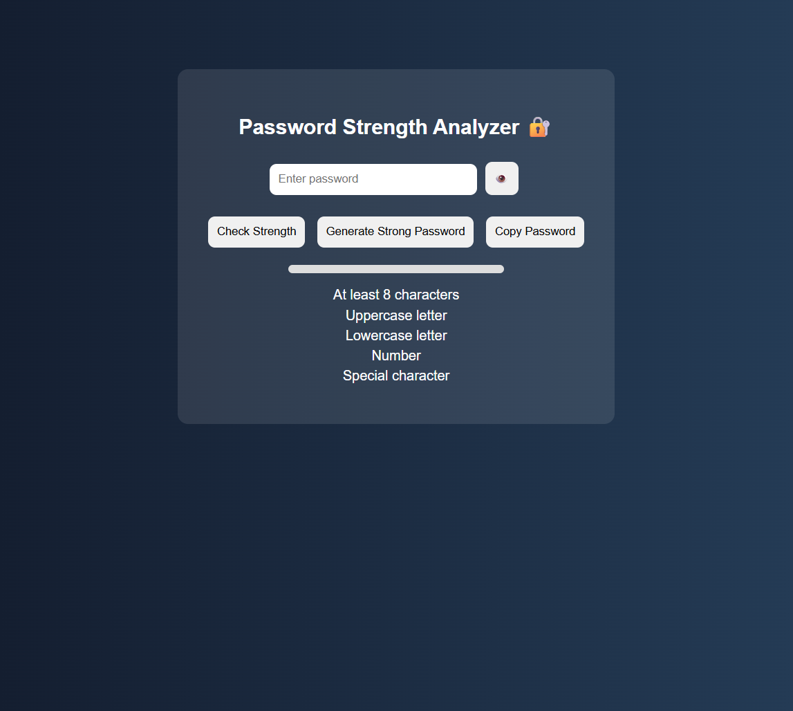
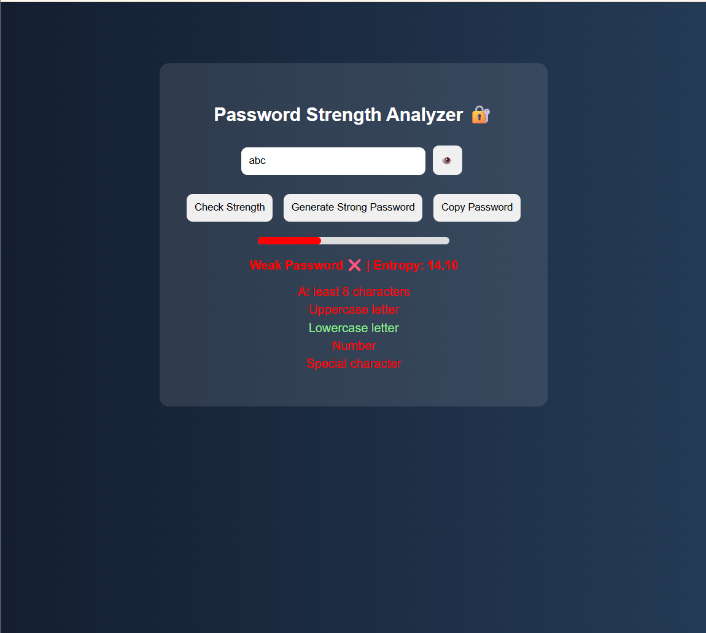
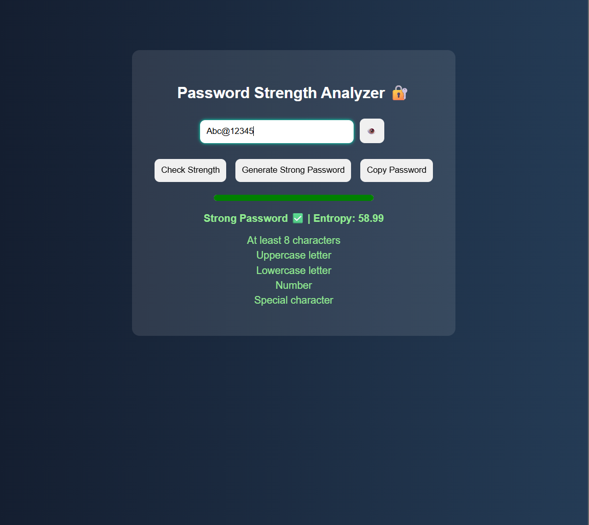

# 🔐 Password Strength Analyzer

A web-based tool that evaluates password strength using real-time validation and entropy calculation.

---

## 🌐 Live Demo
https://ayeshanaz1602.github.io/password-analyzer/

---

## 🚀 Features
- Real-time password strength checking  
- Strength meter visualization  
- Password generator  
- Show/Hide password  
- Copy to clipboard  
- Entropy-based analysis  

---

## 🛠️ Tech Stack
- HTML  
- CSS  
- JavaScript  

---

## 📌 What I Learned
- Password security fundamentals  
- Regex-based validation  
- Entropy calculation  
- GitHub deployment using GitHub Pages  

---
## 📸 Screenshots

---

## ⚠️ Note
This is a frontend-based project for learning purposes and does not implement backend security or hashing mechanisms.
